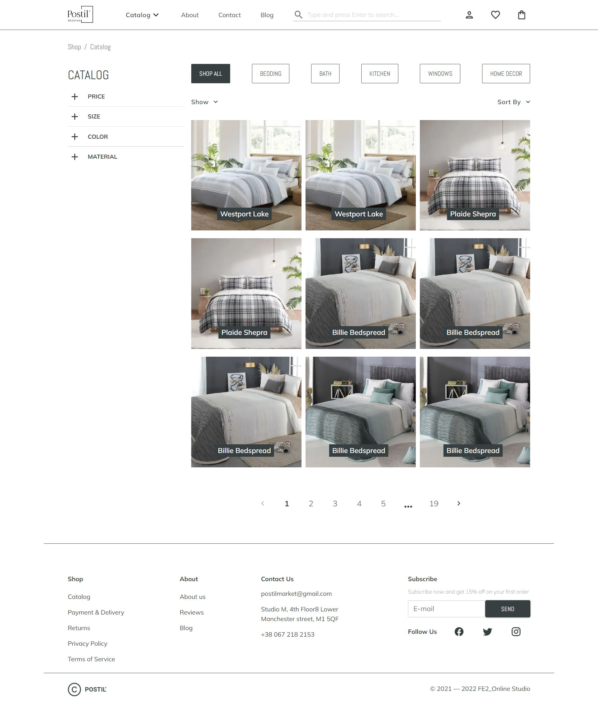
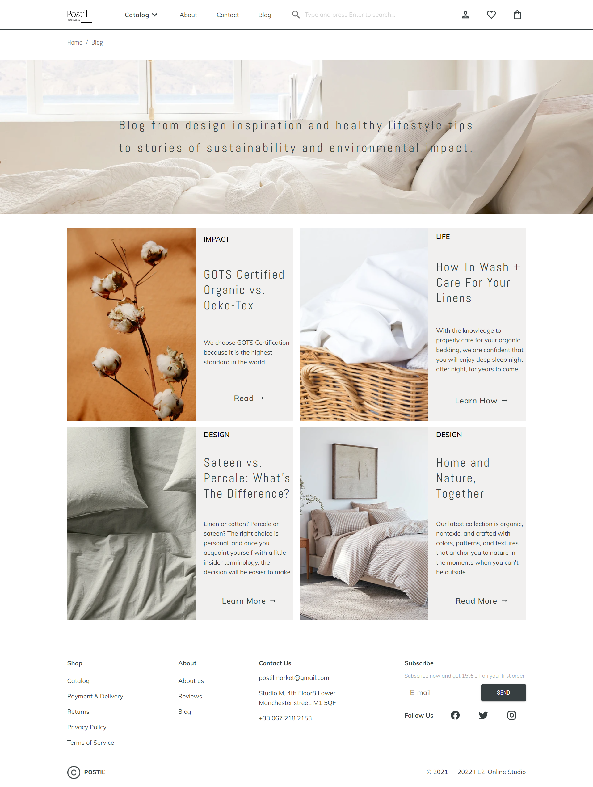
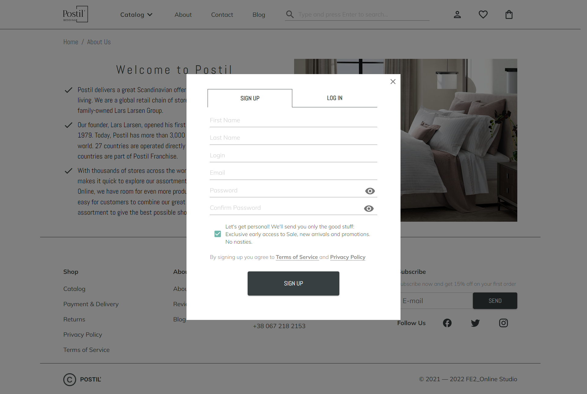
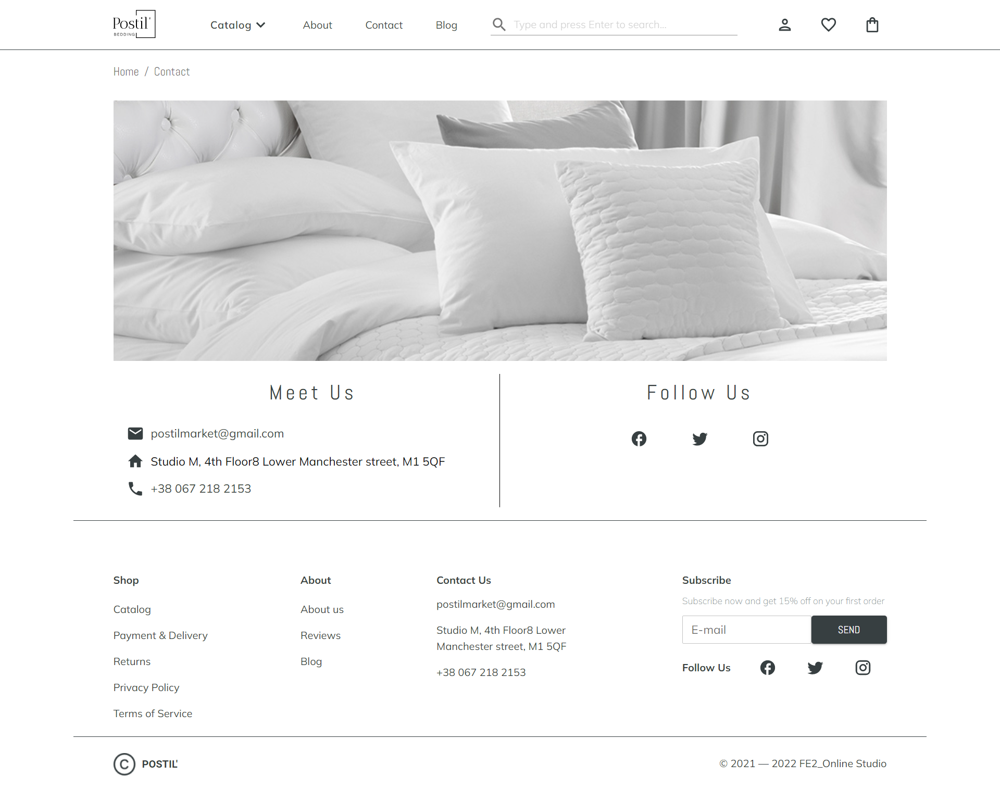
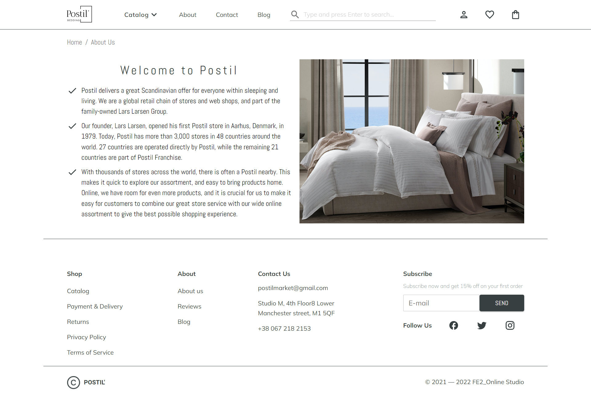

# Postil Bedding

 

Internet Shop of goods for home comfort

## Main features

- Authorization, Log in, Log Out
- Product filters with query parameters
- Favorite product feature
- Cart and fullfledged checkout process
- "You might like" and "Related items" sections
- Single product page
- Pagination
- Responsive web-design

Used technologies:

- React
- React-Router
- Redux
- Formik, Yup
- Material UI
- MongoDB
- Node.js
- Express
- SCSS
- JavaScript(ES6+)
- HTML5

## Running the local server

1. Open a new bash shell
2. `npm install` or `yarn install`
3. `npm run server` or `yarn server`

## Run application

1. Open a new bash shell
2. `cd client`
3. `npm install` or `yarn install`
4. `npm run start` or `yarn start`

### Gallery

  
  
  
  
  

